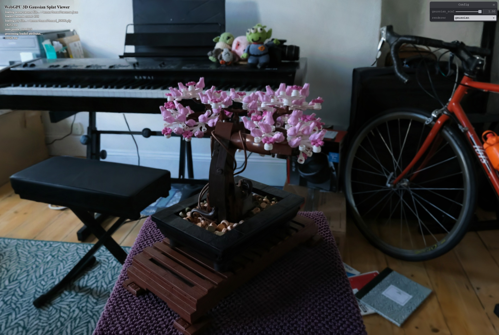
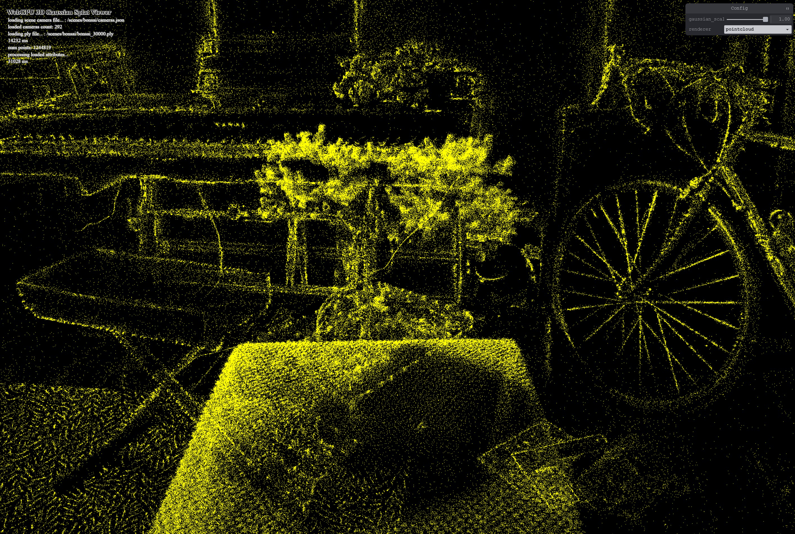

# WebGPU 3D Gaussian Splats Viewer

⚠️ Many TODOs and unoptimized path

This is a WebGPU 3D gaussian splats viewer in typescript.

(Please see [license from the original paper](https://github.com/graphdeco-inria/gaussian-splatting?tab=License-1-ov-file#readme) for details on "Gaussian Splatting" usage).

## Getting started

This repo doesn't include model files. To test locally, please download the ply files and put them under `/public/scenes/`, together with their `cameras.json` file.

Currently the loading url is hardcoded as `/public/scenes/bonsai/bonsai_3000.ply`.

So to run locally, you should have the following model files downloaded:
```
/public/scenes/bonsai/bonsai_3000.ply
/public/scenes/bonsai/cameras.ply
```

Run

```sh
npm install
npm run dev
```

Go to `localhost:5173` in your WebGPU supported browser.

## Models

You can download models from [Selected ones by MarcusAndreasSvensson on Google Drive](https://drive.google.com/drive/folders/1WXCpR3kshQt2jmOtuCBsHKfzt1IMqey2) or [The original paper's full model (14G)](https://repo-sam.inria.fr/fungraph/3d-gaussian-splatting/datasets/pretrained/models.zip)

Currently tested models:
* bonsai_30000.ply
* bicycle_30000.cleaned.ply

## Screenshots

| gaussian splats renderer | point cloud renderer|
|--|--|
|||


## Descriptions

The reference implementation is [web-splats](https://github.com/KeKsBoTer/web-splat) which is in rust and turns out to have good performance compared to some other existing viewer.

Unlike the original paper using a tiled cuda software (but on gpu) rasterizer, this viewer draws transparent 2d splats in screen space, sorted by depth, and send to render pipeline directly for blending. The blending result is gauranteed to be correct as long as the splats are sorted and corresponding blending function is used, based on the fact that the output order of primitives generated by modern graphics API is guaranteed to match their input order. e.g. [Vulkan spec: primitive order](https://registry.khronos.org/vulkan/specs/1.3/html/chap20.html#drawing-primitive-order).

The viewer basically contains 3 stages:

* preprocess: unpack loaded ply model data to gpu buffers, for each 3D gaussian splats calculate their screen space 2D splat representation (position, color), also do some culling to reduce total number of splats neede for sorting
* sort: radix sort sorting the 2D splat primitives order based on their screen depths
* gaussian renderer: draw the 2D splats and alpha blend them correctly
  * pointcloud renderer: this can help verify data unpacking & camera matrix correctness

## TODOs:

* [ ] Optimize loader: currently I use PLY loader from loader.gl and process them again to fit the viewer's need in main process. This is slow, inefficient, and hang the browser. Likely fix: load in web worker, write customize loader to process by line.
* [ ] use WebGPU feature "shader-f16".
* [ ] Decouple sort. Fix sort for general cases.
  - I tested with [webgpu-radix-sort](https://github.com/kishimisu/WebGPU-Radix-Sort) and that mostly worked (it doesn't have indirect dispatch though)
* [ ] github page deployment (where to host model?)
* [ ] performance metrics

## Reference

* [web-splats](https://github.com/KeKsBoTer/web-splat)
* [gaussian-splatting (the original paper repo)](https://github.com/graphdeco-inria/gaussian-splatting)
* [gaussian-splatting-webgpu](https://github.com/MarcusAndreasSvensson/gaussian-splatting-webgpu)
